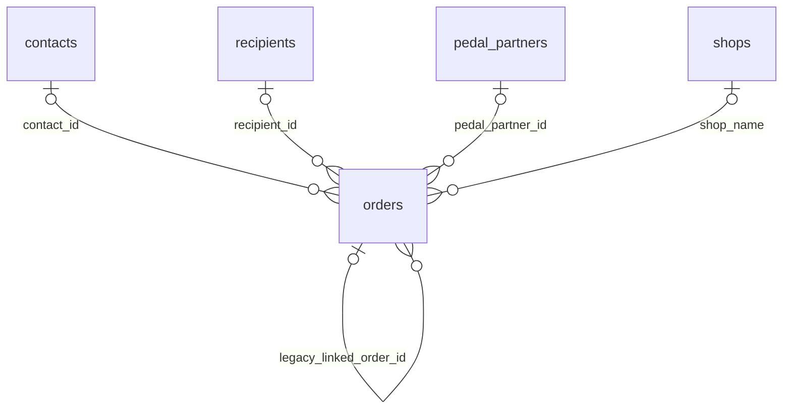
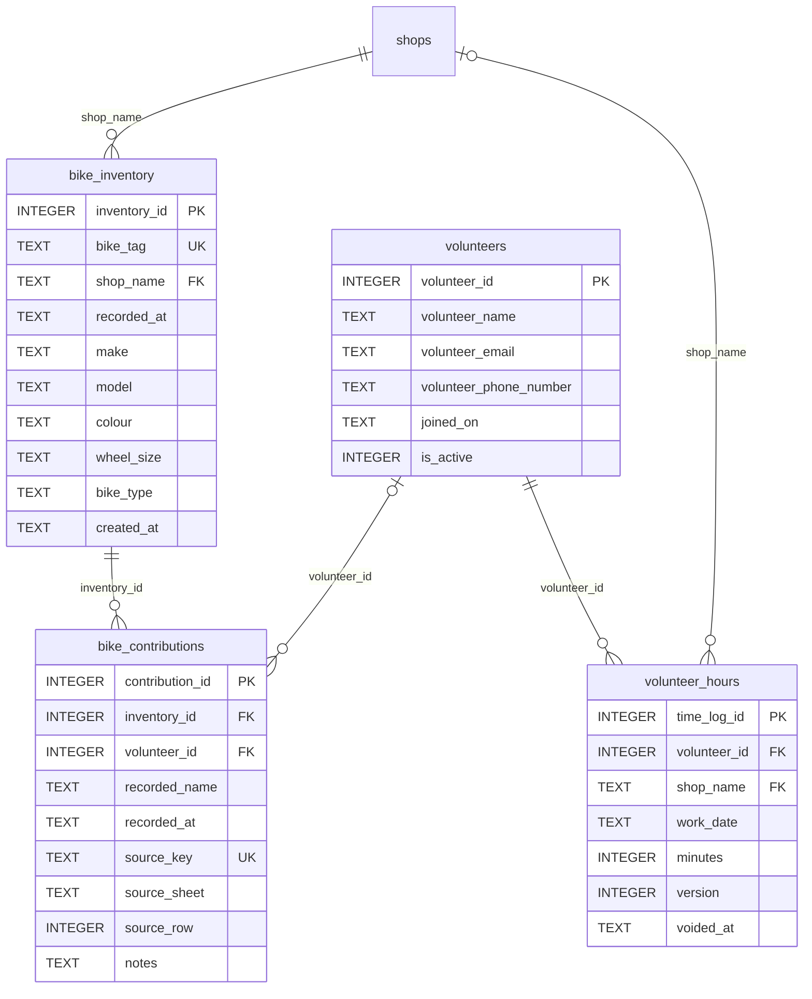

# PIF Portal database

Updated **2026-10-06**. This describes the implementation in
`codex/database-cleanup`, verified against the active development database and
disposable design preview using read-only schema inspection. It is documentation,
not a migration script.

## Current state

| Area | Status |
| --- | --- |
| Storage | SQLite; `DB_PATH` selects the file, default `data/processed/pif.db` |
| Active database | July-era orders plus recent app edits; existing people, shops, users and requester-link tables |
| Workshop schema | Maintenance v5 implemented and enabled in the disposable preview; not applied to the active database |
| Finished bikes | Staff lookup/entry and volunteer self-entry; unique global tags and multiple contributions |
| Volunteers | Staff create profiles; shared IDs connect contributions and hours |
| Hours | Staff entry/corrections and volunteer-facing name lookup, exact hours/minutes and remembered-name preference |
| Workbook | Cleaned/reconciled staging awaiting review; no active database cutover |
| Pending | Final QR artwork/hosting address, reviewed historical import, broader staff corrections |

Schema sources: [admin_tools.py](../admin_tools.py),
[order_intake.py](../order_intake.py), and the legacy definitions preserved by
[fix_person_ids.py](../scripts/fix_person_ids.py). Runtime behavior lives in
[workshop.py](../workshop.py), [volunteer_entry.py](../volunteer_entry.py),
[requester_links.py](../requester_links.py) and [app.py](../app.py).

## Relationships and order semantics

**One `orders` row represents one bike line for one recipient.** Multi-bike intake
creates multiple rows with separate `order_id` values. There is no order-header
table or quantity column. `linked_order_id` is a legacy logical self-reference;
new intake does not populate it as a grouping key.

Order Desk groups lines by contact, order date, shop and order type. This display
convention is not a durable order identity. Row counts, display-group counts and
workbook order-number counts are different measures.

### Order relationships: logical links

The current `orders` table declares no foreign keys for these references.
Historical missing references can still exist.



### Workshop relationships: declared foreign keys



A historical contribution may have no matched volunteer ID. Time logs require a
volunteer, but can have no shop at the SQL level: staff can enter unassigned
activity, while the volunteer-facing form requires a shop.

There is **no FK between orders and inventory**, or between hours and bikes/orders.
An order's tag can be looked up when a match exists; an order remains usable
without one. Contributions never infer hours. Inventory does not track
availability, reservations or allocation.

Audit/receipt tables use generic entity names and IDs, not FKs. Actor strings can
be staff names or `volunteer-self:<id>` and do not require a matching `users` row.

## Table reference

### Orders and people

| Table | Identifier | Other columns |
| --- | --- | --- |
| `orders` | `order_id INTEGER PK AUTOINCREMENT` | Integer `linked_order_id`, `contact_id`, `recipient_id`, `pedal_partner_id`; legacy `bike_tag REAL`; text `shop_name`, `order_date`, `order_type`, `order_status`, `last_status`, `last_updated_date`, `last_updated_by`, `pickup_date`, `notes`, `age`, `height`, `bike_style_preference`, `bike_type_first_choice`, `bike_type_second_choice` |
| `contacts` | `contact_id INTEGER PK AUTOINCREMENT` | `contact_name TEXT`, `contact_phone_number REAL`, `contact_email TEXT` |
| `recipients` | `recipient_id INTEGER PK AUTOINCREMENT` | `recipient_name TEXT`, `bike_style_preference TEXT`, `age REAL`, `height TEXT`, `bike_type_first_choice TEXT`, `bike_type_second_choice TEXT` |
| `pedal_partners` | `pedal_partner_id INTEGER PK AUTOINCREMENT` | `pedal_partner_name TEXT` |
| `shops` | Unique index on `shop_name TEXT`, not a declared PK | `shop_location TEXT`; B = Bentonville, R = Rogers, S = Springdale |

Order status defaults to Open and last editor to System. Phone/email are optional;
supplied values receive form validation. Recipients have no separate channel
columns: channels belong to the linked contact person. Phone and order-tag REAL
storage is legacy and has not been migrated to text.

New intake creates one recipient per bike and puts bike choices/notes on the
order line. Legacy recipient attributes can still provide display fallbacks.
Contacts with no channels are not merged by name alone; otherwise reuse checks
name, email and phone together. Names are not unique person identifiers.

### Finished inventory and contributions

| Table/column | Storage and constraints |
| --- | --- |
| `bike_inventory.inventory_id` | Integer PK, autoincrement |
| `bike_tag` | Required nonblank unique text plus a canonical-tag unique index |
| `shop_name` | Required text FK to shops |
| `recorded_at` | Optional source/finished timestamp text |
| `make`, `model`, `colour`, `wheel_size`, `bike_type` | Optional text; retain wheel units and source type descriptions |
| `created_at` | Required UTC ingestion timestamp text |
| `volunteers.volunteer_id` | Integer PK |
| `volunteer_name` | Required text; not unique |
| `volunteer_email`, `volunteer_phone_number` | Optional text |
| `joined_on` | Optional ISO date; unknown historical dates remain NULL |
| `is_active` | Required integer 0/1, default 1; no profile/history deletion |
| `bike_contributions.contribution_id` | Integer PK, autoincrement |
| `inventory_id` | Required integer FK to inventory |
| `volunteer_id` | Optional integer FK to volunteers |
| `recorded_name`, `recorded_at` | Optional original contributor label and timestamp text |
| `source_key` | Optional unique text import/web provenance key |
| `source_sheet`, `source_row` | Optional text sheet name and integer row number |
| `notes` | Optional contribution note; volunteer form allows up to 2,000 characters |

Tags are globally unique across all shops and years. Numeric leading zeros are
ignored: `00123` equals `123`. Other tags retain text and case. The expression
index also prevents numeric aliases through direct SQL. Bike types are not
restricted to the legacy A–E codes.

Staff bike entry requires an existing shop, tag containing a digit, nonfuture
finished time and at least one known volunteer. These requirements are stricter
than nullable source fields in SQL. Duplicate tags link to the existing record;
additional contributions preserve the original bike details.

One bike can have many contributions and one volunteer can contribute to many
bikes. Repeated work by the same person is allowed; there is no unique bike/person
pair. Contribution counts are not distinct-volunteer counts.

Staff alone create profiles. Matching names require explicit confirmation of a
different person rather than automatic merging. Historical combined labels stay
unresolved until reviewed and mapped to confirmed IDs. New form contributions
select existing IDs and keep a name snapshot; CLI/source contributions can retain
an unmatched name.

### Volunteer hours

| Column | Storage and constraints |
| --- | --- |
| `time_log_id` | Integer PK, autoincrement |
| `volunteer_id` | Required integer FK to volunteers |
| `work_date` | Required text; app validates YYYY-MM-DD |
| `minutes` | Required integer; SQL check enforces integer storage and 1–1,440 per entry |
| `shop_name` | Optional text FK to shops |
| `activity`, `notes` | Optional text; form limits 200 and 2,000 characters |
| `created_at`, `created_by` | Required text creation timestamp and attribution |
| `updated_at`, `updated_by` | Required text last-change timestamp and attribution |
| `version` | Required integer, default 1; increments on correction/void |
| `voided_at`, `void_reason` | Optional text; invalidation without deletion |

Each row is one manually reported session. **2 hours 17 minutes stores 137 minutes**,
without quarter-hour rounding. Staff enter decimal hours converted to whole
minutes; volunteers enter separate integer hours/minutes.

Multiple sessions per day are allowed. The app sums nonvoided time for the
person/date across shops and rejects totals over 1,440. This aggregate rule is
application validation, not a SQL constraint. `BEGIN IMMEDIATE` serializes app
writes so concurrent submissions cannot both pass an outdated total check.

Future dates are rejected. Volunteer defaults/validation use America/Chicago;
current staff defaults use server local date. Corrections require a reason and
the displayed version; stale edits fail. Voiding retains the row and audit but
excludes it from totals. Filtered totals cover all matching active rows, independent
of pagination. Public users cannot list, correct or void existing logs.

### Requester links and submission receipts

| Table | Columns | Purpose |
| --- | --- | --- |
| `request_invites` | `invite_id INTEGER PK AUTOINCREMENT`; unique required text `token_hash`, `issuance_key`; required text `label`, `shop_name`, `order_type`, `pedal_partner_name`, `issued_by`; required integer `created_at`, `expires_at`; optional integer `used_at`, `revoked_at` | Expiring link for one successful order submission |
| `order_submissions` | `submission_key TEXT PK`, `order_ids TEXT NOT NULL`, `created_at TEXT NOT NULL` | JSON list of created order IDs; form retry protection |
| `workshop_submissions` | `submission_key TEXT PK`, `entity TEXT NOT NULL`, `entity_id INTEGER NOT NULL`, `created_at TEXT NOT NULL` | Retry receipt for profiles, bikes, contribution actions or hours |

These tables declare no FKs. `order_ids` is JSON, not a join table. Invite routing
is set by staff and cannot be changed by the requester. Only the secret's hash is
stored. Successful intake writes every line and its receipt and consumes the
invite atomically. Unused links can be revoked; expiry choices are 1, 7 or 14 days.
Invite timestamps are Unix seconds, unlike workshop ISO timestamps.

Signed, session-bound, purpose-specific tokens protect form submissions. A retry
of the same form reuses its receipt; a fresh form can create a legitimate repeat
request/session. Different forms are not deduplicated by name/date/duration.

### Accounts, audit and migration metadata

| Table | Columns and role |
| --- | --- |
| `users` | `userid INTEGER PK AUTOINCREMENT`, `username`, `password_hash`; legacy staff accounts, no role field or unique username constraint in the inspected schema |
| `login_logs` | `id INTEGER PK AUTOINCREMENT`, `username`, `ip_address`, `device_info`, `login_time TIMESTAMP DEFAULT CURRENT_TIMESTAMP`; no user FK |
| `admin_changes` | `change_id INTEGER PK AUTOINCREMENT`; required text `changed_at`, `actor`, `reason`, `entity`, `entity_id`, `before_json`, `after_json` |
| `history_migrations` | `migration_id TEXT PK`; required text `source_hash`, `applied_at`, `report_json`; created by the July migration when used, absent from inspected active/preview databases |

Audit records cover maintenance and workshop writes. Time corrections/voids store
full before/after rows; other actions retain relevant values and linked IDs. This
is not a complete database event history. Existing order-status updates use
`last_updated_by`, `last_updated_date` and `last_status` and do not all write audit
rows. There is no separate web administrator role. CLI authorization comes from
local database access; `--actor` validates an existing username for attribution,
not a password or permission level.

## Access and volunteer QR flow

| Entry point | Access | Effect |
| --- | --- | --- |
| `/volunteers` | Staff | Create/search profiles |
| `/inventory`, `/inventory/new`, `/inventory/<id>` | Staff | Lookup, bike entry and contributions |
| `/volunteer-hours` and new/edit/void routes | Staff | List/filter totals, enter/correct/void time |
| `/volunteer-hours/links` | Staff | Shop-specific URLs for reusable QR codes |
| `/volunteer/log-hours?shop=B` | No staff login | Select existing name and submit time; R/S supported |
| `/volunteer/finished-bike?shop=B` | No staff login | New finished bike or confirmed contributions to an existing tag; R/S supported |
| `/volunteer/bike-thanks` | Submitting browser | Bike/contribution receipt; no inventory history or contact channels |
| `/volunteer/names?q=...` | No staff login | Up to ten matching names/IDs, minimum two characters; no contact details |
| `/volunteer/thanks`, `/volunteer/forget` | Submitting browser | Session receipt or clearing preference; forgetting requires a valid form token |
| `/request-links` | Staff | Issue/revoke single-use requester links |
| `/request/<secret>` | Valid invite holder | One order submission with staff-selected routing |

Volunteer flow: **scan shop QR → find/select name → optionally remember it → enter
time → save → receipt**. Shop/date are editable, duration starts blank and details
are optional. Missing volunteers ask staff to add them. Namesakes display IDs.
The form hides staff navigation even when the browser also has a staff session.

Self-entry actor is `volunteer-self:<id>` and audit reason is `Self-reported volunteer
hours`. Name selection is attribution, **not identity verification** or staff
access. Volunteer links are reusable; requester order links are single-use.

Remembering a name stores a signed volunteer ID for 180 days in an HTTP-only,
SameSite=Lax cookie scoped to `/volunteer` (Secure on HTTPS). It is not a table or
an authentication account. “Not you?” clears the preference and session receipt;
saving with the option unchecked also clears the preference. The receipt contains
name, duration, date and shop in the signed Flask browser session, not a public
history endpoint. Keep a stable private `SECRET_KEY`.

QR artwork and the final phone-reachable hostname are not configured. Localhost
links work only on the same computer. Hosting/Tailscale remains outside app scope.
Volunteer-facing Finished Bikes shares the remembered-name preference with hours.
Each submission records exactly one selected volunteer and an optional note.
Other volunteers submit separately against the same tag. Notes are linked to the
contribution and displayed with its volunteer ID in the staff bike detail view;
names mentioned in free text do not create attributions. Staff alone create profiles. Timestamp is captured at save in UTC;
the QR shop is editable for a new bike. Tag and details share one section. Make and
model suggest existing values; wheel size, A–F bike type and basic colour choices
use dropdowns, with colour swatches and the New Order picture guide. All details
remain optional; Other wheel sizes/colours can be explained in the contribution
note. Listed values are validated for new public entries without changing legacy
records. A direct hours link follows the selected shop.

Checking a tag does not write data. Existing tags require an explicit confirmation
bound to the reviewed inventory ID and record fingerprint. Confirmation adds
contributions without changing the original bike/shop/timestamp; changed tags
must be reviewed again. Public lookup shows only that bike's descriptive fields,
not previous contributor names, notes or contact channels. New bikes, contributions,
audit and retry receipt commit atomically. Actor attribution is
`volunteer-self:<id>`; no hours or order lines are created. The bike receipt is
stored in the submitting session and includes only tag, shop, submitter and count.
Maintenance v4 adds the nullable `notes` column to `bike_contributions`; no new
table is needed. Older contributions keep their IDs, provenance and null notes.

## Integrity, dates, indexes and dashboard

Workshop/maintenance connections enable `PRAGMA foreign_keys=ON`. The general
[database.py](../database.py) connection does not enable it globally. FKs require
that setting on each writing connection. New tables declare no cascade deletes;
legacy links need explicit review.

| Explicit index | Purpose |
| --- | --- |
| `ux_shops_shop_name` | Unique non-null shop codes |
| `ux_inventory_canonical_tag` | Numeric tag uniqueness after leading-zero normalization; other text retained |
| `ix_bike_contributions_inventory` | Contributions by inventory ID |
| `ix_volunteer_hours_date` | Hours by `(work_date, volunteer_id)` |

PK/unique declarations also provide SQLite's implicit uniqueness handling.
Nullable unique fields can contain multiple nulls. Daily total caps, nonfuture
dates and input-format limits are app rules, not general SQL checks.

Workshop creation/update/audit/void times use UTC ISO text. Inventory `recorded_at`
preserves source timing; staff datetime-local input has no timezone, while later
contributions use UTC. Order timestamps use server local time. Order, pickup and
work dates are calendar dates; do not assume one legacy timestamp format/timezone.

Workflow allows Open → Contacted, Open/Contacted → Cancelled and Cancelled → Open.
Completing a Contacted line records pickup date/tag and sets Completed. Restoration
returns to Open, not automatically to `last_status`.

Dashboard counts **Completed bike lines** by pickup-date year/month and shop, not
intake dates, distinct tags, inventory or grouped orders. Partly completed orders
contribute only completed lines. It avoids recipient joins that could multiply or
hide legacy rows. See [dashboard-count-review.md](dashboard-count-review.md).

## Initialization and local maintenance

Maintenance v3 adds/reuses the six workshop/audit tables and indexes. It does not
import staging, replace orders or drop legacy data. Stop the app and rehearse on
an existing disposable copy; specify the exact path when using a worktree.

```sh
# Preview, then deliberately apply the additive setup.
python scripts/admin_db.py --db /path/to/pif.db init
python scripts/admin_db.py --db /path/to/pif.db init --apply --actor USER --reason 'Enable workshop tables'

# Inspect and preview an order-line correction.
python scripts/admin_db.py --db /path/to/pif.db show-order 123
python scripts/admin_db.py --db /path/to/pif.db edit-order 123 --changes '{"notes":"Corrected note"}'

# Apply the same correction with the returned preview version.
python scripts/admin_db.py --db /path/to/pif.db edit-order 123 --changes '{"notes":"Corrected note"}' --apply --version VERSION --actor USER --reason 'Correct order note'

# Preview an inventory insert, or perform an exact tag lookup.
python scripts/admin_db.py --db /path/to/pif.db add-bike --values '{"bike_tag":"12345","shop_name":"B","make":"Trek","wheel_size":"26 inch"}'
python scripts/admin_db.py --db /path/to/pif.db lookup-bike 12345
```

CLI commands refuse to create a missing database. `add-bike` also needs
`--apply --actor USER --reason TEXT` to write. CLI changes/initialization back up
committed SQLite content, including WAL content, to sibling `backups/`. Stale
preview versions fail; no-op order edits create no audit row. An audit failure
rolls back the mutation. Normal web entries use atomic audit/receipts, not a full
backup per submission. Backups and reports contain private data.

Editable order fields: notes, shop_name, pickup_date, bike_tag,
bike_type_first_choice, bike_type_second_choice. JSON values are quoted text or
null. Completed lines retain pickup details; tags must fit the exact integer range
of legacy REAL storage. Clearing a choice is rejected if it exposes a shared
recipient fallback. Shared people, IDs, status and invites are outside this CLI
editor; use the existing workflow for status changes.

Early inventory schemas upgrade additively: inline names copy once to contributions
and the old column remains. Existing numeric aliases stop index creation for review.
v2 uses the same init command to add v3 hours/receipts; v4 adds contribution notes
with `ALTER TABLE` when needed. `maintenance-v5` is an audit marker, not a
schema-version table. Initialization backs up first and is safe to repeat. Workshop requests never migrate schema; they
show an unavailable message until setup. Order/requester routes separately use
`order_intake.ensure_schema()` for their two additive tables. v5 adds volunteer joined dates and active flags; existing volunteers default to
active with unknown joined dates. All workshop/public volunteer routes require v5.

Retain the backed-up [shop repair](../scripts/fix_duplicate_shops.py) and
[person-ID repair](../scripts/fix_person_ids.py) for older imports. No maintenance
CLI command sends email or starts scheduled jobs.

## Historical staging and cutover

Work on `codex/spreadsheet-cleanup` is separate. Preserve the source
`data/raw/PIF 2025 .xlsx`, provenance, app IDs and recent changes. Workbook row and
order numbers are not app order IDs. Confirmed preparation rules:

- Ignore `Date Picked Up`. Missing order dates use valid `Pick up`, otherwise remain
  for review. Blank channels are valid. A usable recipient name can fill a missing
  contact name; standalone Son/Daughter/etc. labels are not recipient names.
- Missing/ambiguous order shops default to B. Confident cleaned-app matches supply
  correct information; conflicts and instructions remain in Notes. Ambiguous
  matches remain for review.
- Keep Recently Deleted, bad form and Online Form Responses separate for review.
- Exclude missing inventory tags and placeholders TEST/TEST2/TEST3/Need/Trailer bike/
  Xxxx. Review other unusual tags; normalize numeric zeros.
- Inventory defaults missing/multiple/unknown shops to B. Repeated tags keep the
  earliest timestamp's bike details, source row breaking ties. Preserve all
  contributions and superseded-detail provenance; earliest blank fields stay blank.
  These are import rules, not permission to overwrite interactive records.

Latest staging: 6,251 candidate order rows, 5,190 confident app matches and 1,200
rows carrying data-review flags; inventory has 14,995 unique bikes and 15,461
contributions. These are **staging figures**, not active inventory counts. Review
artifacts are in the primary checkout's ignored `data/outputs` and `data/processed`.
No staged import/cutover has been performed.

Before cutover: reconcile against a fresh backup, preserve intervening app edits,
resolve reviewed mappings, rehearse the import, compare counts/links and validate
inventory FKs/integrity, then perform one backed-up import.
[migrate_history.py](../scripts/migrate_history.py) handles only July normalized
CSVs, not the latest workbook. Its ledger rejects different sources under one
migration ID. Older `orders_data.csv` uses a different ID namespace.

## Legacy tables and verification

Inspected databases retain `bikes`, `bikes_test`, `orders_50`, `orders_old` and
`orders_test`. Current operations use `orders` and `bike_inventory`. Do not drop
retained data during code cleanup. Legacy `bikes` references nonexistent
`shops.shop_id` and is not the new inventory model. A blanket legacy FK check can
fail independently of new tables; validate new relationships explicitly and track
legacy repair separately.

Removed prototypes (`csv2table.py`, `db_setup.py`, `migrate.py`, `manage_db.py`,
`migration_001.sql`, `schema.sql`, `data_exploration_streamlit.py`) are not setup
authorities. Git retains their history.

Latest verified app suite: 138 Python tests; the previous 3 Node checks also passed. Tests cover individual
notes and attribution, retry protection, separate contributors to one bike,
escaped staff note display, migration preservation/backups and rollback. Separate synthetic
browser databases verified phone-sized hours entry, remembering/forgetting, new
finished bikes, nonwriting tag checks and confirmed contributions to an existing
tag. The revised individual contribution form was visually checked at 390px. Active data and historical staging remain unchanged.

## Volunteer yearly summary

Log Hours displays a summary only for a selected or remembered volunteer. The user
explicitly approved aggregate totals and active-week visibility through public name
selection on 2026-10-06. `POST /volunteer/impact` requires a session-bound form token
and an existing volunteer ID, and reads only totals. It does not provide individual
logs, notes or contact information. The form remains add-only; staff authentication
is still required for corrections/voids. The receipt includes updated totals after
saving. Older receipts without a volunteer ID safely omit the summary.

`volunteer_impact.py` calculates calendar-year activity through today across shops:
nonvoid minutes by work date, distinct inventory IDs by dated contributions linked
to the volunteer ID, and the union of active weeks. Offset timestamps use
America/Chicago; naive historical timestamps use their local date. Undated or
unparseable contributions are omitted. Each bike counts once even with repeated
contributions. Unlinked historical work is not inferred from matching names.

A two-row weekly strip has active, empty and upcoming cells with accessible summary
text. No new tables or migration are required. The staff-authenticated
`/volunteers/<id>/impact` page remains available as a preview.

## Volunteer lifecycle fields

Staff management creates profiles with optional `joined_on` (today by default in
Chicago) and an Active/Inactive choice. The date must be valid and not in the
future. `/volunteers/<id>/edit` changes only these fields, checks the prior values
for concurrent edits, and writes an atomic audit record plus retry receipt.

Inactive people remain visible in staff management, hours history and bike
contributions, and staff can record historical work for them. Public name search,
remembered selection, summaries by selected ID and new self-entry require an active
profile. No historical hours/contributions are removed or excluded from staff
reports by this flag. Staff can reactivate a profile. The explicit backed-up v5
upgrade preserves existing IDs and contacts, sets `is_active=1`, and leaves
`joined_on` NULL; it never infers a joining date from imports.
